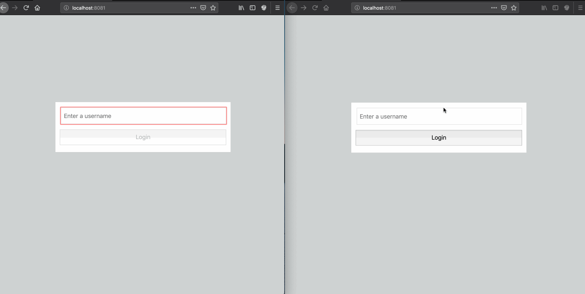

# How to integrate a multilingual chatbot into your Chatkit App using Vue

This is a demo application showing how to build a Chat bot using Flask, Dialogflow and Pusher. You can read the tutorial on how it was built [here](https://pusher.com/])



## Prerequisite
 
Install:
- Ngrok
- Node (if you don't have it installed already).

 
## Getting Started

These instructions will get you a copy of the project up and running on your local machine for development and testing purposes.

## How to set up

- Clone the repository to your machine
```
git clone https://github.com/dongido001/chatkit-trbot.git
```

- Create your environment keys:

```
cp .env.example .env

```

- Then, head to your chatkit dashboard and get your:
    - Instance Locator 
    - Secret Key.
    - Test Token Provider Endpoint

- Update your .env file with th credemtials above.
- On your chatkit console, create a number of users including -`trbot` which will stand in as our bot.
- Also, create some rooms from the console.
- Next, create a GCP project:
    - [Create a Cloud Platform project](https://console.cloud.google.com/project) as `trbot`.
    - [Enable billing for your project](https://support.google.com/cloud/answer/6293499#enable-billing).
    - [Enable the Google Cloud Translation API](https://console.cloud.google.com/flows/enableapi?apiid=translate.googleapis.com). Select the project you just created(`trbot`) and hit the continue button.
    - [Go to Google Cloud Platform](https://console.cloud.google.com/home/dashboard). 
    - Copy out the Project ID. Then add the Project ID to the `.env` file:
    ```
        YOUR_PROJECT_ID=<Project ID>
    ```

    - Next, go to *APIs & Services* then *Credentials* to download 
    - Under *Create credentials*, click on *Service account key*
    - Then select *JSON* under *Key type*.
    - Finally, click on the Create button to download your API key
    - opy the downloaded JSON file ( `trbot-*.json`) to the server folder.


> Note: This is your API key, you should not commit it to a public repository.

Next, add the path to the file to the `.env` file:

```
    GOOGLE_APPLICATION_CREDENTIALS=trbot*.json
```

Make sure to use the correct file name instead of `trbot-*.json`.

## Setup the client

- Install Dependencies:
```
npm install
```

- Run the app

```
npm run serve
```


## Setup the server

Open another terminal, then:

- Go to the server folder:

```
cd server
```

- Install Dependencies:
```
npm install
```

- Run the app

```
node app.js
```

Open up Ngrok and expose the URL:


```
    ./ngrok http 3000
```

Head to your Chatkit Dashboard and enable the webhook.